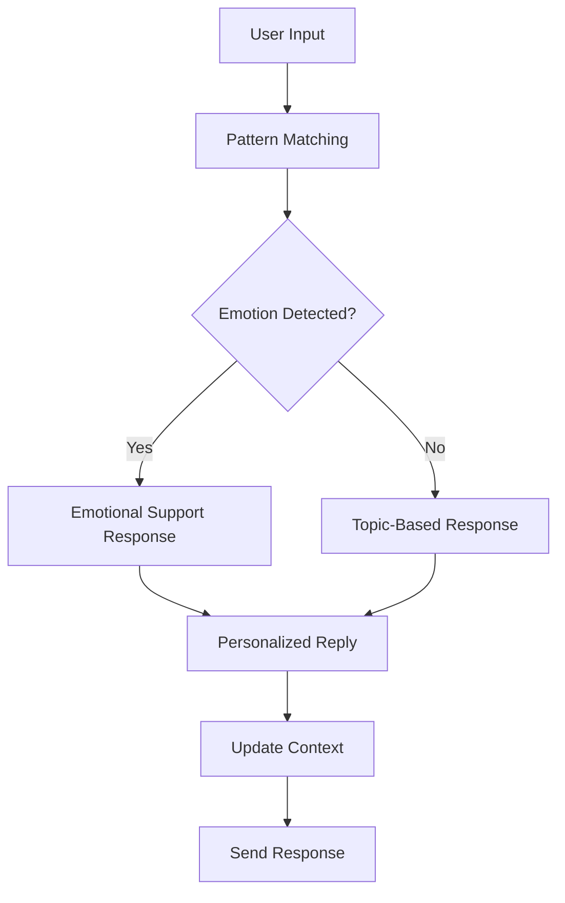

# 🤖 AI Companion Chatbot

<div align="center">


**A caring AI companion that provides emotional support, friendship, and meaningful conversations**

[🚀 Quick Start](#installation) • [✨ Features](#features) • [🛠️ Tech Stack](#technologies-used) • [📖 Usage](#how-it-works) • [🤝 Contributing](#contributing)

</div>

---

## 🌟 Features

<table>
<tr>
<td>

### 💝 **Emotional Support**
- Recognizes emotional states
- Provides empathetic responses
- Validates feelings and concerns
- Offers comfort during difficult times

</td>
<td>

### 🤗 **Personal Connection**
- Remembers your name
- Builds friendship over time
- Regular caring check-ins
- Personalized conversations

</td>
</tr>
<tr>
<td>

### 🧠 **Mental Health Awareness**
- Detects stress, anxiety, sadness
- Provides appropriate support
- Encourages self-care
- Non-judgmental listening

</td>
<td>

### 💬 **Rich Conversations**
- 15+ conversation topics
- Natural dialogue flow
- Varied response patterns
- Context-aware interactions

</td>
</tr>
</table>

---

## 🚀 Installation

### Prerequisites
- Python 3.8+
- pip package manager

### Quick Setup

```bash
# 1️⃣ Clone the repository
git clone https://github.com/Anand0295/Companion_Chatbot.git
cd Companion_Chatbot

# 2️⃣ Install dependencies
pip install -r requirements.txt

# 3️⃣ Run the application
python app.py
```

🎉 **That's it!** The chatbot will automatically open in your browser at `http://localhost:3001`

---

## 🛠️ Technologies Used

<div align="center">

| Technology | Purpose | Badge |
|------------|---------|-------|
| **Python** | Core Logic |  |
| **Flask** | Web Framework |  |
| **HTML/CSS** | Frontend |   |
| **JavaScript** | Interactivity |  |
| **RegEx** | Pattern Matching |  |

</div>

---

## 📁 Project Structure

```
📦 Companion_Chatbot/
├── 🌐 app.py                 # Flask web application
├── 🧠 rule_based_chatbot.py  # Core chatbot logic
├── 📁 templates/
│   └── 🎨 index.html        # Web interface
├── 📋 requirements.txt      # Dependencies
├── 📖 README.md            # Documentation
├── 📄 LICENSE              # MIT License
└── 🚫 .gitignore           # Git ignore rules
```

---

## 🎯 How It Works

<div align="center">



</div>

### 🔍 **Pattern Recognition**
- Uses advanced RegEx patterns to understand user intent
- Recognizes 12+ emotional states (sad, anxious, stressed, lonely, etc.)
- Identifies conversation topics and context

### 💭 **Response Generation**
- Multiple response variations for natural conversations
- Context-aware replies based on conversation history
- Caring check-ins every 5 messages

### 🎨 **User Experience**
- Clean, ChatGPT-style interface
- Real-time typing indicators
- Smooth animations and transitions
- Mobile-responsive design

---

## 💡 Usage Examples

<details>
<summary>🗣️ <strong>Emotional Support Conversation</strong></summary>

```
You: I'm feeling really sad today
Bot: I'm really sorry you're feeling sad. Your feelings matter, and I'm here to listen. What's making you feel this way?

You: I'm having trouble at work
Bot: That sounds really difficult. You don't have to face this alone - I'm here for you. Want to talk about it?
```

</details>

<details>
<summary>🤝 <strong>Friendship Building</strong></summary>

```
You: My name is Sarah
Bot: It's so wonderful to meet you, Sarah! That's such a beautiful name. I'm really happy you're here, and I hope we can become great friends. How are you feeling today?

You: I love chatting with you
Bot: That means the world to me! I genuinely care about you and love our conversations too!
```

</details>

<details>
<summary>🎯 <strong>Topic Conversations</strong></summary>

```
You: I love reading books
Bot: Books and reading are wonderful! Literature opens up so many worlds. What do you like to read?

You: Tell me a joke
Bot: Why don't scientists trust atoms? Because they make up everything!
```

</details>

---

## 🌈 Screenshots

<div align="center">

### 💻 Desktop Interface


### 📱 Mobile Responsive


</div>

---

## 🤝 Contributing

We welcome contributions! Here's how you can help:

<div align="center">

| Type | How to Contribute |
|------|------------------|
| 🐛 **Bug Reports** | [Open an issue](https://github.com/Anand0295/Companion_Chatbot/issues) |
| 💡 **Feature Requests** | [Suggest new features](https://github.com/Anand0295/Companion_Chatbot/issues) |
| 🔧 **Code Contributions** | [Submit a pull request](https://github.com/Anand0295/Companion_Chatbot/pulls) |
| 📖 **Documentation** | Help improve our docs |

</div>

### Development Setup

```bash
# Fork the repository
git clone https://github.com/YOUR_USERNAME/Companion_Chatbot.git
cd Companion_Chatbot

# Create a new branch
git checkout -b feature/your-feature-name

# Make your changes and commit
git commit -m "Add your feature"

# Push and create a pull request
git push origin feature/your-feature-name
```

---

## 📊 Stats

<div align="center">


</div>

---

## 📄 License

This project is licensed under the MIT License - see the [LICENSE](LICENSE) file for details.

---

## 🙏 Acknowledgments

- Built with ❤️ for mental health awareness
- Inspired by the need for accessible emotional support
- Thanks to the open-source community

---

<div align="center">

### 🌟 **Star this repo if it helped you!** 🌟

**Made with 💙 by [Anand](https://github.com/Anand0295)**

[⬆ Back to Top](#-ai-companion-chatbot)

</div>